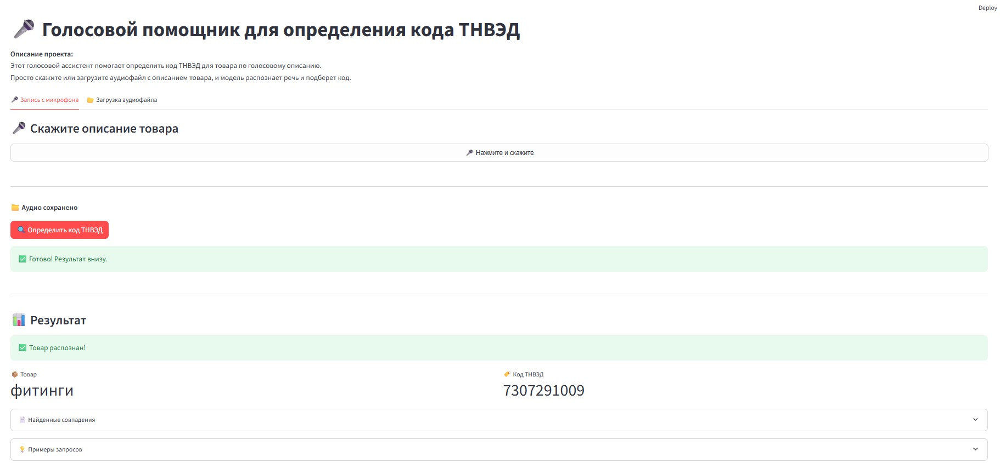
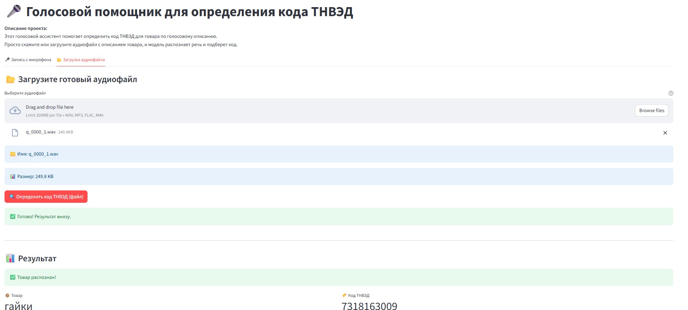

**Исполнитель - Сучкова Мария stepik ID 635120251**

Ноутбук с проектом по ссылке на моем гугл диске - https://drive.google.com/file/d/1zz3MmnwzrJ6ktDnStrTCfraBazuiB7KS/view?usp=drive_link

🎤 **ТНВЭД Голосовой Ассистент**

Голосовой помощник для определения кода ТНВЭД по аудио-описанию товара. Проект позволяет загрузить аудиофайл с описанием товара или проговорить вопрос с запросом кода товара через микрофон и получить код ТНВЭД в формате JSON. Примеры аудиофайлов приложены (q_0001_0.wav,q_0002_0.wav), также приложена видеозапись использования приложения (запись_приложения_демо.mp4).

Сам код товара ТНВЭД нужен для правильной классификации товара и заполнения таможенной декларации, от кода ТНВЭД зависит начисление таможенных пошлин. Такой голосовой помощник может помочь не только работникам, занимающимися таможенным оформлением товаров, но и просто участникам ВЭД (покупатели, продавцы, логисты, агенты, перевозчики, которые занимаются внешней экономической деятельностью).

📋 **Описание проекта**

Ассистент использует мультимодальную, мультиязычную модель Gemma 3n от Google для распознавания речи и извлечения кода ТНВЭД из аудио. Модель работает полностью локально (без обращения к облачным API) и поддерживает русский язык. Модель для более точного определения кода товара использует базу данных товаров (в основном это запчасти и инструмент к гражданским самолетам).

**Ключевые возможности:**

🎤 Загрузка аудиофайлов через браузер из папки или запись аудио через микрофон

🧠 Распознавание речи и извлечение описание товара из аудио

🏷️ Определение кода ТНВЭД по описанию товара

📊 Вывод результата в формате JSON

🔍 Поиск товара в базе данных Excel по описанию

Скриншот работы приложения с записью вопроса через микрофон и определением кода ТНВЭД

Скриншот работы приложения с загрузкой аудиофайла и определением кода ТНВЭД

🚀 **Установка и запуск**

Требования

Python 3.10+

8+ GB RAM (для работы модели)

15+ GB свободного места на диске

GPU не требуется (работает на CPU)

**Установка**

Клонируйте репозиторий:

bash

git clone <url-репозитория> cd tnved_assistant

Создайте виртуальную среду:

bash Через conda (рекомендуется)

conda create -p ./.tnved_env python=3.10 -y conda activate ./.tnved_env

Или через venv

python -m venv .tnved_env source .tnved_env/bin/activate # Linux/Mac

.tnved_env\Scripts\activate # Windows

Установите зависимости:

bash

pip install -r requirements.txt

Настройте токен Hugging Face:

В файле app_microphone.py замените HF_TOKEN = "hf_токен" на ваш токен.

Зарегистрируйтесь на huggingface.co

Создайте токен в Settings → Access Tokens

Примите лицензию на модель google/gemma-3n-e2b-it

Запустите приложение:

bash

streamlit run app_microphone.py

🎯 **Использование**

Откройте приложение в браузере (обычно http://localhost:8501)

Загрузите аудиофайл с описанием товара или используйте микрофон и задайте вопрос голосом

Нажмите "Определить код ТНВЭД"

Получите результат в формате JSON

**Пример**

Вход: аудио с текстом "Какой код товара для гайки стальные диаметром 10 мм?"

Выход:

json { "product": "гайки стальные диаметром 10 мм", "hs_code": "7318163009" }

🏗️ **Архитектура**

Аудио → Gemma 3n → Распознавание речи → Извлечение товара → JSON

Модель обрабатывает аудио напрямую, без промежуточного ASR-этапа (в отличие от классических пайплайнов).

📊 **Расширенное использование (поиск по Excel)**

Для более точного определения кода ТНВЭД можно добавить поиск по базе Excel. В проекте (в ноутбуке) реализован инструмент SmartSearchTool с:

Стеммингом (приведение слов к основе)

Поиском по n-граммам (сочетаниям букв)

Ранжированием по релевантности

Пример использования:

python

searcher = SmartSearchTool('data/hs_codes.xlsx') results = searcher.search("гайка стальная")

[{'product_name': 'ГАЙКА СТАЛЬНАЯ', 'hs_code': '7318163009', 'score': 99}]

⚠️ **Известные ограничения**

Требовательность к памяти: модель занимает ~6-8 GB RAM на CPU (смотря какая версия модели)

Время обработки: на CPU один аудиофайл обрабатывается 60-90 секунд

Качество аудио: модель лучше работает с аудио в формате 16 кГц, моно

Язык: поддерживается русский язык, но иногда может переходить на другие языки

**Модель не загружается**

Проверьте интернет-соединение

Убедитесь, что приняли лицензию на Hugging Face

Проверьте правильность токена